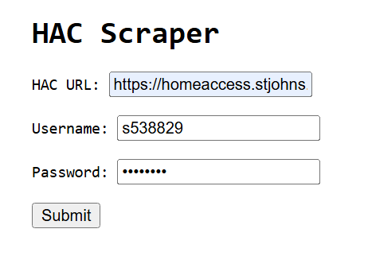
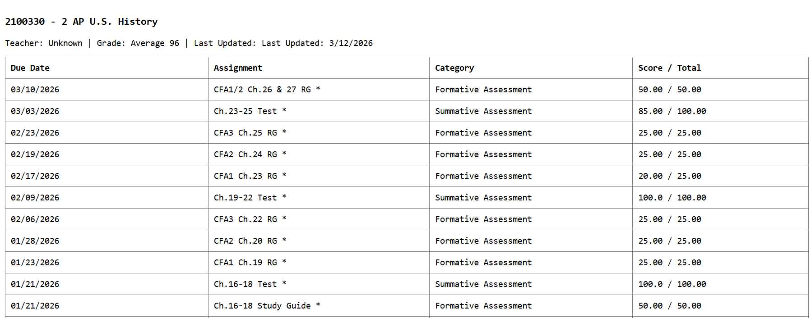

# HAC Scraper

A super-fast, stateless scraper for PowerSchool Home Access Center (HAC) built with Next.js 15

## Demo

Rough Live UI for Demo - Hosted on Vercel ↓

## Screenshots

## Tech Stack

* **Framework:** [Next.js 15](https://nextjs.org/) (App Router) / React 19
* **Backend:** Next.js Server Actions (Node.js runtime)
* **Parsing:** [Cheerio](https://cheerio.js.org/) for fast, server-side HTML traversal.
* **Communication:** Standard fetch API for session management.

## Features
* The scraper extracts a dataset from the HAC portal including:

    * Full name and grade context.
    * Real-time averages, class names, and teacher contact info.
    * Full breakdown for every class including:
        * Assignment Name & Category (Formative, Summative).
        * Due Dates and "Last Updated" timestamps.
        * Scores and Total Points possible.
* Session Management: Automatically handles `RequestVerificationToken` and cookie-based persistence across requests.
* Avoids heavy headless browsers, making it ideal for integration into mobile apps or student dashboards.
* Built to run efficiently on Vercel Functions.
## Safety

* **Stateless:** No database is connected. Data exists only in memory for the duration of the request.
* **No Retention:** Credentials (Username/Password) are transmitted over HTTPS, used to authenticate with the school's server, and immediately discarded.
* **Direct Interaction:** Scraper acts as a bridge between the user and the official school server.
## Author and Licensing

* **Shravan Mani**
* [GNU GPLv3](https://choosealicense.com/licenses/gpl-3.0/)

##
*Disclaimer: This project is not affiliated with PowerSchool or any school district. It is intended for educational and developmental purposes only.*
